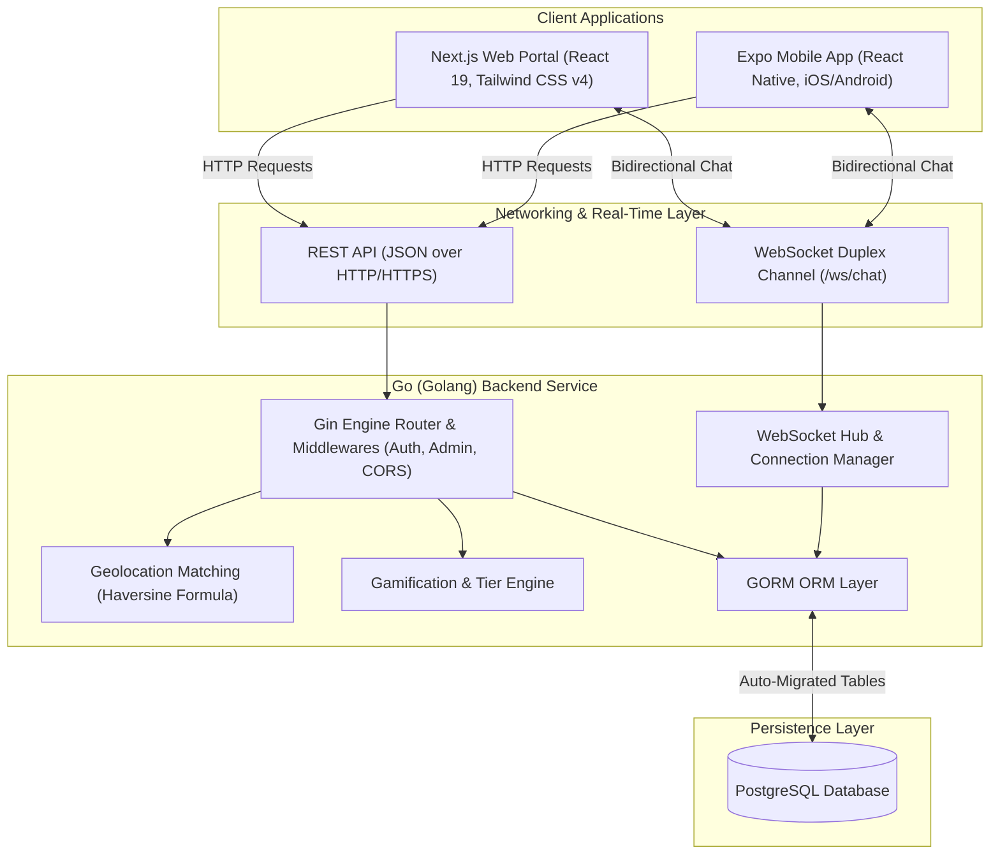

# BloodHero: Real-Time Blood Donation & Emergency SOS Network

[](https://golang.org/)
[](https://nextjs.org/)
[](https://react.dev/)
[](https://reactnative.dev/)
[](https://expo.dev/)
[](https://www.postgresql.org/)
[](https://tailwindcss.com/)
[](LICENSE)

**BloodHero** is a full-stack, real-time, event-driven blood donation management and emergency SOS response platform. It bridges the critical time gap between blood donors, recipients, and medical facilities during urgent shortages by combining **live geolocation matching (Haversine algorithm)**, **biological compatibility verification**, **instant 1-on-1 WebSocket chat**, **digital QR donor passes**, **appointment scheduling**, and **gamified donor recognition**.

The platform is engineered as a decoupled monorepo comprising a high-throughput **Go (Golang)** backend, a modern **Next.js 16 (React 19)** web portal, and a cross-platform **React Native (Expo SDK 56)** mobile application.

---

## GitHub Repository Metadata

### Repository Description (About Box)
> An event-driven, real-time blood donation and emergency SOS dispatch ecosystem featuring live geolocation matching, digital QR donor cards, appointment scheduling, gamified donor rewards, and instant chat. Built with Go (Gin + WebSockets), Next.js 16 (React 19), and React Native (Expo SDK 56).

### Repository Topic Tags
```text
blood-donation, emergency-sos, healthcare, golang, gin-gonic, websockets, postgresql, gorm, nextjs, react19, react-native, expo, expo-router, typescript, tailwindcss, real-time, monorepo, healthtech
```

---

## Table of Contents

- [System Architecture](#system-architecture)
- [Monorepo Directory Layout](#monorepo-directory-layout)
- [Key Features](#key-features)
- [Blood Compatibility Matrix](#blood-compatibility-matrix)
- [Backend Deep-Dive (Go)](#1-backend-deep-dive-go)
  - [Tech Stack & Dependencies](#backend-tech-stack--dependencies)
  - [Core Architecture & Services](#backend-architecture--services)
  - [Database Models & Schema](#database-models--schema)
  - [REST & WebSocket API Reference](#rest--websocket-api-reference)
  - [Backend Configuration & Environment](#backend-configuration--environment)
  - [Backend Setup & Execution](#backend-setup--execution)
- [Frontend Deep-Dive (Next.js Web Client)](#2-frontend-deep-dive-nextjs-web-client)
  - [Tech Stack & Architecture](#frontend-tech-stack--architecture)
  - [App Router Navigation & Pages](#app-router-navigation--pages)
  - [Design System & UI Components](#frontend-design-system--ui-components)
  - [Frontend Setup & Execution](#frontend-setup--execution)
- [Mobile App Deep-Dive (React Native & Expo)](#3-mobile-app-deep-dive-react-native--expo)
  - [Tech Stack & Architecture](#mobile-tech-stack--architecture)
  - [Mobile Screens & Navigation](#mobile-screens--navigation)
  - [Key Mobile Capabilities](#key-mobile-capabilities)
  - [Mobile Environment & Device Setup](#mobile-environment--device-setup)
  - [Mobile Setup & Execution](#mobile-setup--execution)
- [License & Contributions](#license--contributions)

---

## System Architecture



---

## Monorepo Directory Layout

```text
blood-donation-system/
├── backend/                       # Go REST API & WebSocket server
│   ├── cmd/
│   │   └── main.go                # Application entrypoint & route registration
│   ├── internal/
│   │   ├── config/                # Environment config & PostgreSQL GORM init
│   │   ├── handlers/              # Auth, profile, requests, bookings, rewards, admin handlers
│   │   ├── models/                # GORM schemas (User, Profile, Request, Booking, etc.)
│   │   └── websocket/             # Client connection pool & message broadcast Hub
│   ├── .env.example               # Template environment configuration
│   ├── go.mod                     # Go module definitions
│   └── go.sum                     # Go checksum records
│
├── frontend/                      # Next.js 16 App Router web application
│   ├── src/
│   │   ├── app/                   # App Router pages (/, /dashboard, /requests, /book, etc.)
│   │   ├── components/            # Reusable UI cards, navbars, modals, and charts
│   │   └── lib/
│   │       └── api.ts             # Strongly-typed fetch API client & auth handlers
│   ├── public/                    # Static assets & brand media
│   ├── package.json               # Frontend dependencies & build scripts
│   ├── postcss.config.mjs         # Tailwind CSS PostCSS configuration
│   └── tsconfig.json              # TypeScript compilation rules
│
└── mobile/                        # React Native cross-platform app (Expo SDK 56)
    ├── src/
    │   ├── app/                   # File-based navigation screens (SOS feed, Digital Card, etc.)
    │   ├── components/            # Mobile-optimized UI widgets & interactive elements
    │   ├── constants/             # Design tokens, color palettes & typography
    │   ├── context/               # Dark/Light theme state providers
    │   └── utils/
    │       └── api.ts             # Mobile HTTP and WebSocket client wrapper
    ├── assets/                    # Mobile icons, splash screens & mock imagery
    ├── app.json                   # Expo manifest configuration
    ├── package.json               # Mobile dependencies & run scripts
    └── tsconfig.json              # TypeScript configuration
```

---

## Key Features

1. **🚨 Instant Emergency SOS Broadcasting**:
   - Create urgent blood request broadcasts with designated urgency flags, target hospital/clinic locations, and expiration timestamps.
   - Calculates geographic donor-to-recipient distance using the **Haversine formula** to surface nearby potential donors first.
2. **🩸 Biological Compatibility Verification**:
   - Automatically cross-checks red blood cell (RBC) compatibility (e.g., $O^-$ universal donor, $AB^+$ universal recipient) before suggesting donor matches.
3. **💬 Real-Time 1-on-1 WebSocket Chat**:
   - Persistent bidirectional communication between donors and requesters without HTTP polling overhead.
   - Includes unread counters, delivery states, and history persistence in PostgreSQL.
4. **💳 Digital Donor Pass & QR Clinic Check-in**:
   - Dedicated mobile view featuring a digital donor card with blood type indicator, donation count badge, and a generated QR matrix for rapid clinic verification.
5. **📅 Appointment Booking & Slot Management**:
   - Donors can browse participating donation centers, choose preferred date slots, and track appointments through `Pending`, `Completed`, or `Cancelled` states.
6. **🏆 Gamification, XP & Printable SVG Certificates**:
   - Every logged donation yields experience points (XP) that upgrade donors across **Bronze**, **Silver**, **Gold**, and **Platinum** tiers.
   - Users can dynamically preview and download customized printable SVG certificates celebrating their milestone donations.
7. **🛡️ Comprehensive Admin Command Suite**:
   - Dedicated admin portal to monitor platform-wide KPIs, moderate blood requests, manage registered users, and update booking statuses.

---

## Blood Compatibility Matrix

BloodHero embeds the international standard Red Blood Cell (RBC) compatibility chart for donor-recipient matching:

| Recipient Blood Group | Compatible Donor Blood Groups | Notes |
| :--- | :--- | :--- |
| **O-** | `O-` | Universal Donor to all; can receive only from O- |
| **O+** | `O-`, `O+` | High demand donor |
| **A-** | `O-`, `A-` | Compatible with A and AB groups |
| **A+** | `O-`, `O+`, `A-`, `A+` | Common recipient group |
| **B-** | `O-`, `B-` | Compatible with B and AB groups |
| **B+** | `O-`, `O+`, `B-`, `B+` | Common recipient group |
| **AB-** | `O-`, `A-`, `B-`, `AB-` | Can receive from any Rh-negative group |
| **AB+** | **All Blood Types** (`O-`, `O+`, `A-`, `A+`, `B-`, `B+`, `AB-`, `AB+`) | **Universal Recipient** |

---

## 1. Backend Deep-Dive (Go)

The BloodHero backend is constructed with **Go (Golang)** using the high-performance **Gin** framework and **GORM** for relational database access.

### Backend Tech Stack & Dependencies

- **Language**: Go (`1.20+`)
- **Web Framework**: [`gin-gonic/gin`](https://github.com/gin-gonic/gin) — High-speed HTTP router and middleware pipeline.
- **ORM & Database**: [`gorm.io/gorm`](https://gorm.io/) with [`gorm.io/driver/postgres`](https://github.com/go-gorm/postgres).
- **Authentication**: [`golang-jwt/jwt/v5`](https://github.com/golang-jwt/jwt) — Secure signed JWT access tokens.
- **Security**: [`golang.org/x/crypto/bcrypt`](https://pkg.go.dev/golang.org/x/crypto/bcrypt) — Salted password hashing.
- **Real-Time WebSockets**: [`gorilla/websocket`](https://github.com/gorilla/websocket) — Upgraded HTTP-to-WS sockets with concurrent client hub management.
- **Configuration**: [`joho/godotenv`](https://github.com/joho/godotenv) — Environment variable hydration.

### Backend Architecture & Services

- **`internal/config/config.go`**: Loads environment variables and establishes the PostgreSQL pool with automatic database schema migration on boot (`AutoMigrate`).
- **`internal/websocket/hub.go`**: Implements the Goroutine-backed event loop that manages connected socket clients, registers client channels, unregisters dropped connections, and broadcasts direct messages to target recipients.
- **`internal/handlers/`**:
  - `auth.go`: User registration, password hashing, and JWT token issuance.
  - `profile.go`: User profile retrieval, geolocation coordinates, and personal updates.
  - `requests.go`: Creation, listing, filtering, and emergency dispatch of blood requests with Haversine distance calculations.
  - `bookings.go`: Booking slot creation, listing user appointments, and cancellations.
  - `donations.go` & `rewards.go`: Donation event logging, XP incrementation, and tier calculation.
  - `chats.go`: Historical message retrieval and read receipt updates.
  - `admin.go`: Aggregated analytics (total donors, active requests, completed appointments) and administrative moderation endpoints.

### Database Models & Schema

```go
// Core entities defined in backend/internal/models/models.go
User          -> ID, Username, Email, PasswordHash, Role, Profile (1-to-1)
Profile       -> UserID, DateOfBirth, PhotoURL, Availability, Gender, BloodType, City, PhoneNumber, Latitude, Longitude
BloodRequest  -> RequesterID, FirstName, LastName, BloodType, ContactNumber, Location, Latitude, Longitude, IsEmergency, ExpiresAt
Booking       -> UserID, FirstName, LastName, Date, TimeSlot, Location, Status ('Pending', 'Completed', 'Cancelled')
DonationMade  -> DonorID, Date, Location, BloodType, QuantityML, Notes, PointsEarned
Chat          -> ID, Participants (Many-to-Many with User), Messages
Message       -> ChatID, SenderID, ReceiverID, Content, IsRead, CreatedAt
```

### REST & WebSocket API Reference

#### Public Endpoints (No Auth Required)
| Method | Endpoint | Description |
| :--- | :--- | :--- |
| `POST` | `/api/register` | Register a new user account with profile info |
| `POST` | `/api/login` | Authenticate credentials and receive signed JWT token |
| `GET` | `/api/requests` | Fetch active blood requests with optional filters |
| `GET` | `/api/requests/count` | Retrieve total count of open blood requests |

#### Protected Endpoints (Requires `Authorization: Bearer <token>`)
| Method | Endpoint | Description |
| :--- | :--- | :--- |
| `GET` | `/api/users` | List eligible registered donors and profiles |
| `PUT` | `/api/profile` | Update current user's profile and coordinates |
| `POST` | `/api/requests` | Create an emergency or standard blood request |
| `POST` | `/api/bookings` | Schedule a new donation appointment |
| `GET` | `/api/bookings` | List user's scheduled donation appointments |
| `DELETE` | `/api/bookings/:id` | Cancel a scheduled donation appointment |
| `POST` | `/api/donations` | Log a completed donation and earn XP |
| `GET` | `/api/donations` | View authenticated user's donation history |
| `GET` | `/api/rewards` | Get user's current XP, badges, and reward tier status |
| `GET` | `/api/chats` | List conversations and latest messages |
| `GET` | `/api/chats/:other_id/messages` | Retrieve full message thread with a user |
| `POST` | `/api/chats/:other_id/read` | Mark message thread as read |
| `GET` | `/ws/chat` | WebSocket handshake endpoint for real-time messaging |

#### Admin Endpoints (Requires `Role: admin`)
| Method | Endpoint | Description |
| :--- | :--- | :--- |
| `GET` | `/api/admin/stats` | Retrieve platform KPI summary and counts |
| `GET` | `/api/admin/users` | List all users across the system |
| `DELETE` | `/api/admin/users/:id` | Delete a specific user account |
| `GET` | `/api/admin/bookings` | List all donation appointments system-wide |
| `PUT` | `/api/admin/bookings/:id` | Update booking status (`Pending`/`Completed`/`Cancelled`) |
| `GET` | `/api/admin/requests` | List all active and past blood requests |
| `DELETE` | `/api/admin/requests/:id` | Remove a blood request |

### Backend Configuration & Environment

Create a `.env` file in the `backend/` directory:

```env
PORT=8080
DATABASE_URL=host=localhost user=postgres password=postgres dbname=blood_donation port=5432 sslmode=disable
JWT_SECRET=your_super_secret_jwt_signing_key_change_me
```

| Variable | Type | Description | Default |
| :--- | :--- | :--- | :--- |
| `PORT` | Number | Port on which the HTTP server listens | `8080` |
| `DATABASE_URL` | String | PostgreSQL connection DSN | Localhost Postgres |
| `JWT_SECRET` | String | Secret key used to sign and verify HMAC JWTs | Required |

### Backend Setup & Execution

1. Navigate to the backend directory:
   ```bash
   cd backend
   ```
2. Copy and configure the environment file:
   ```bash
   cp .env.example .env
   ```
3. Ensure PostgreSQL is running and the database `blood_donation` is created:
   ```sql
   CREATE DATABASE blood_donation;
   ```
4. Download Go dependencies:
   ```bash
   go mod download
   ```
5. Run the Go server (runs auto-migrations and starts listener):
   ```bash
   go run cmd/main.go
   ```
   The server will output:
   ```text
   Database connection successfully established!
   Database auto-migration complete.
   Blood Donation System Backend running on port 8080
   ```

---

## 2. Frontend Deep-Dive (Next.js Web Client)

The BloodHero web client is built with **Next.js 16** using the **React 19** App Router, **Tailwind CSS v4**, and **Framer Motion**.

### Frontend Tech Stack & Architecture

- **Framework**: Next.js 16 (`App Router`) with TypeScript
- **Core Library**: React 19 (`react`, `react-dom`)
- **Styling**: Tailwind CSS v4 with PostCSS
- **Icons**: `lucide-react`
- **Animations**: `framer-motion`
- **Interactive Effects**: `canvas-confetti` (for celebration animations upon milestone achievements)
- **API Client Layer**: Typed client in `src/lib/api.ts` managing token persistence in `localStorage`, request signing, and unified error handling.

### App Router Navigation & Pages

| Route | Page File | Functionality & Features |
| :--- | :--- | :--- |
| `/` | `src/app/page.tsx` | Modern landing page with live blood compatibility visualizer, platform metrics, and hero CTA |
| `/login` | `src/app/login/page.tsx` | Secure login with email/password and redirect handling |
| `/register` | `src/app/register/page.tsx` | Multi-step registration capturing blood type, city, phone, and availability |
| `/dashboard` | `src/app/dashboard/page.tsx` | Central user dashboard with SOS alert widgets, next booking card, and quick links |
| `/requests` | `src/app/requests/page.tsx` | Real-time blood request board with emergency flags, distance sorting, and create dialog |
| `/book` | `src/app/book/page.tsx` | Donation center appointment scheduler with interactive time slot picker |
| `/rewards` | `src/app/rewards/page.tsx` | Gamification center: XP progress bar, tier badges, and printable SVG certificate generator |
| `/chat` | `src/app/chat/page.tsx` | Live direct messaging with WebSocket synchronization and conversation drawer |
| `/users` | `src/app/users/page.tsx` | Community donor directory with blood type filters and instant message launcher |
| `/profile` | `src/app/profile/page.tsx` | User profile editor, location coordinate manager, and availability toggle |
| `/admin` | `src/app/admin/page.tsx` | Administrative control panel with stats cards, user moderation, and booking manager |

### Frontend Design System & UI Components

- **Glassmorphism**: Subtle translucent borders (`border-white/10`), backdrop blurs (`backdrop-blur-md`), and high-contrast dark themes.
- **Micro-Animations**: Framer Motion entrance transitions, card hover elevation, and interactive button active states.
- **Form Controls**: Custom blood-drop selectors, calendar slot buttons, and responsive modal dialogs.

### Frontend Setup & Execution

1. Navigate to the frontend directory:
   ```bash
   cd frontend
   ```
2. Install npm dependencies:
   ```bash
   npm install
   ```
3. Start the Next.js development server:
   ```bash
   npm run dev
   ```
4. Access the web interface at `http://localhost:3000`.

---

## 3. Mobile App Deep-Dive (React Native & Expo)

The BloodHero mobile app is built with **React Native 0.85** and **Expo SDK 56**, providing a smooth native experience for iOS and Android devices.

### Mobile Tech Stack & Architecture

- **Runtime**: React Native `0.85.3` / React `19.2.3`
- **Framework**: Expo SDK `56` with file-based `expo-router`
- **UI & Gestures**: `react-native-reanimated` (`v4.3.1`), `react-native-gesture-handler`, `@expo/vector-icons`
- **Safe Area & UI Controls**: `react-native-safe-area-context`, `react-native-screens`, `expo-symbols`, `expo-glass-effect`
- **API & Storage**: Modular API client in `src/utils/api.ts` with WebSocket client connectivity and token storage.

### Mobile Screens & Navigation

The mobile application utilizes `expo-router` file-based navigation with a bottom tab layout (`src/app/_layout.tsx`):

- **Home / SOS Feed (`src/app/index.tsx`)**:
  - Live emergency SOS feed highlighting critical requests.
  - One-tap SOS call and instant chat trigger.
  - Active appointment countdown widget.
- **Digital Donor Card (`src/app/explore.tsx`)**:
  - Displays authenticated user's verified digital donor identity.
  - Renders a stylized, scannable QR verification matrix for clinics to instantly log donations.
  - Shows current badge status (Bronze, Silver, Gold, Platinum) and lifetime donation stats.
- **Blood Requests Feed (`src/app/requests.tsx`)**:
  - Interactive list of open requests filterable by blood type and emergency status.
  - Modal to post new blood requests directly from mobile.
- **Appointment Booking (`src/app/book.tsx`)**:
  - Mobile calendar selector and time slot cards.
  - View upcoming and past appointments with cancellation capability.
- **Rewards & Badges (`src/app/rewards.tsx`)**:
  - XP progress visualizer, milestone unlock tracker, and digital certificate view.
- **Real-Time Chat (`src/app/chat.tsx`)**:
  - Native socket chat view with auto-scrolling message list, input bar, and online statuses.
- **Donor Directory (`src/app/users.tsx`)**:
  - Searchable list of registered blood donors nearby with blood group filters.
- **Admin Management (`src/app/admin.tsx`)**:
  - Mobile-optimized administrative dashboard for on-the-go moderation and statistics checking.

### Key Mobile Capabilities

- **Digital QR Card**: Replaces paper donor booklets; enables clinic barcode/QR scanners to retrieve medical records instantly.
- **Theme Support**: Seamless switching between light and dark themes using `src/context/theme-context.tsx`.
- **Adaptive Network Routing**: Supports local emulation via `10.0.2.2` for Android or `localhost` for iOS and web builds.

### Mobile Environment & Device Setup

Create a `.env` file in the `mobile/` directory:

```env
# iOS Simulator or Web:
EXPO_PUBLIC_API_URL=http://localhost:8080/api
EXPO_PUBLIC_WS_URL=ws://localhost:8080/ws/chat

# Android Emulator (uncomment if running on Android Studio Emulator):
# EXPO_PUBLIC_API_URL=http://10.0.2.2:8080/api
# EXPO_PUBLIC_WS_URL=ws://10.0.2.2:8080/ws/chat

# Physical Device via Expo Go (replace with your development machine's LAN IP):
# EXPO_PUBLIC_API_URL=http://192.168.1.100:8080/api
# EXPO_PUBLIC_WS_URL=ws://192.168.1.100:8080/ws/chat
```

### Mobile Setup & Execution

1. Navigate to the mobile directory:
   ```bash
   cd mobile
   ```
2. Install npm dependencies:
   ```bash
   npm install
   ```
3. Start the Expo development server:
   ```bash
   npm run start
   ```
4. Choose your target platform:
   - Press `i` to launch in the **iOS Simulator** (macOS required).
   - Press `a` to launch in the **Android Emulator**.
   - Press `w` to launch the **Web preview**.
   - Scan the terminal QR code using **Expo Go** on your physical iOS/Android device.

---

## License & Contributions

This project is licensed under the **MIT License**. Contributions, bug reports, and feature pull requests are warmly welcomed to help save lives through technology.
